# DeepSpeed-RLHF-LLaMA

DeepSpeed-RLHF-LLaMA 是一个实用的端到端实现，旨在使用**基于人类反馈的强化学习（RLHF）**对 LLaMA 大语言模型进行微调。本项目基于微软 DeepSpeed-Chat 框架的修改版本构建，专门针对 LLaMA 架构调整了整个 InstructGPT 风格的训练流水线，包含尚未合并到上游的关键错误修复，并提供了一个开箱即用的 Gradio 界面，用于并排对比仅 SFT 模型与 RLHF 对齐模型。

本项目的核心目标是将出了名复杂的三阶段 RLHF 流水线（该项目实现了经典的 InstructGPT 流水线：监督微调 → 奖励模型 → 基于 PPO 的 RLHF。）——监督微调、奖励模型训练以及基于 PPO 的强化学习——在消费级多 GPU 设置（例如 2× A100 80GB）上实现可复现，而无需依赖工业级集群。每个训练步骤均已进行端到端验证，训练曲线和可视化对比作为证据保留在代码库中。


## 项目结构


代码库主要分为三个区域：训练引擎（alpaca_rlhf/deepspeed_chat/training/）、推理接口（alpaca_rlhf/inference/）以及配置资源（templates/、data/、figures/）。

```bash
alpaca-rlhf/

├── 📂 alpaca_rlhf/
│   ├── 📂 deepspeed_chat/
│   │   ├── chat.py                    # 聊天推理的命令行入口
│   │   ├── train.py                   # 统一的 3 步训练入口
│   │   ├── 📂 training/
│   │   │   ├── 📂 step1_supervised_finetuning/   # 阶段 1: SFT
│   │   │   ├── 📂 step2_reward_model_finetuning/ # 阶段 2: Reward Model
│   │   │   ├── 📂 step3_rlhf_finetuning/         # 阶段 3: PPO/RLHF
│   │   │   │   ├── ppo_trainer.py                # PPO 训练循环
│   │   │   │   └── rlhf_engine.py               # 多模型引擎
│   │   │   └── 📂 utils/
│   │   │       ├── 📂 data/
│   │   │       │   ├── data_utils.py             # 数据集创建与整理
│   │   │       │   └── raw_datasets.py           # 14+ 数据集适配器
│   │   │       ├── 📂 model/
│   │   │       │   ├── model_utils.py            # HF 模型创建辅助函数
│   │   │       │   └── reward_model.py           # RewardModel 类
│   │   │       └── 📂 module/
│   │   │           └── lora.py                   # LoRA 实现
│   │   └── 📂 inference/
│   ├── 📂 inference/
│   │   └── llama_chatbot_gradio.py     # Gradio 演示应用
│   ├── 📂 tools/                       # 数据集与模型下载器
│   └── 📂 eda/                         # 探索性数据分析脚本
├── 📂 templates/                       # 提示词模板 JSON 文件
├── 📂 figures/                         # 训练曲线与错误修复对比
├── run.sh                              # DeepSpeed 启动器（训练）
├── run_inference.sh                    # Python 启动器（推理）
└── requirements.txt                    # 依赖项
```

## 三阶段 RLHF 训练流程（Three-Stage RLHF Pipeline）

每个阶段作为独立的入口点运行，依次消费上一阶段的输出并生成新的模型检查点。该设计使训练流程模块化、可复现且易于调试。

### 📊 阶段概览

| 阶段 | 脚本 | 输入模型 | 输出 | 目的 |
|------|------|----------|------|------|
| Step 1 — SFT | `step1_supervised_finetuning/main.py` | LLaMA-7B（base） | SFT Actor 检查点 | 通过监督数据学习指令跟随能力 |
| Step 2 — Reward Model | `step2_reward_model_finetuning/main.py` | LLaMA-7B（base） | Reward Model 检查点 | 从人类偏好数据中学习评分函数 |
| Step 3 — RLHF | `step3_rlhf_finetuning/main.py` | SFT Actor + Reward Model | RLHF 对齐 Actor | 使用 PPO 进行对齐优化，使输出更符合人类偏好 |

---

### 🔍 各阶段细节

- **阶段 1（SFT）**
  - 支持标准 `Dahoas/rm-static` 数据集
  - 支持自定义 `MultiTurnAlpaca` 数据集（多轮对话）
  - 目标：学习基础指令跟随能力（instruction following）

- **阶段 2（Reward Model）**
  - 使用 `chosen / rejected` 响应对
  - 训练目标：成对排序损失（pairwise ranking loss）
  - 输出一个用于打分的 Reward Model

- **阶段 3（RLHF）**
  - 将 SFT Actor + Reward Model + Reference Model + Critic 组合到 `DeepSpeedRLHFEngine`
  - 使用 PPO（Proximal Policy Optimization）进行强化学习训练
  - 优化目标：在保持语言能力的同时对齐人类偏好

---

### ⚙️ 训练流程总结

```text
Base Model (LLaMA-7B)
        ↓
Step 1: SFT
        ↓
SFT Actor
        ↓
Step 2: Reward Model
        ↓
Reward Model
        ↓
Step 3: PPO (RLHF)
        ↓
Aligned Actor (Final Model)
```


## 基于 DeepSpeed Chat 的改动

### 第一步（Step 1）

- alpaca_rlhf/deepspeed_chat/training/step1_supervised_finetuning/main.py#main()

- 设置特殊标记（special tokens）

- 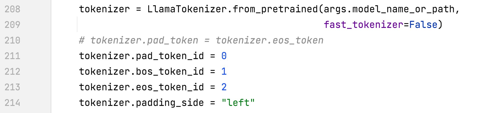

- alpaca_rlhf/deepspeed_chat/training/utils/data/data_utils.py#create_dataset_split()

- 仅在回复部分进行训练，并添加 EOS（结束标记）

- 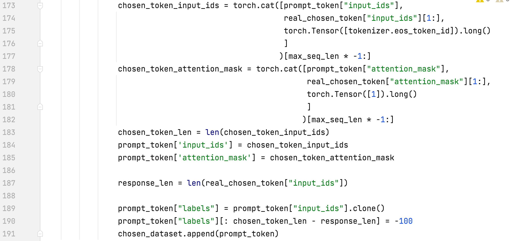

- 移除对话结束标记（end_of_conversation_token）

- 

- alpaca_rlhf/deepspeed_chat/training/utils/data/data_utils.py#PromptDataset#__getitem__

- 标签（labels）与输入（input）不同

- 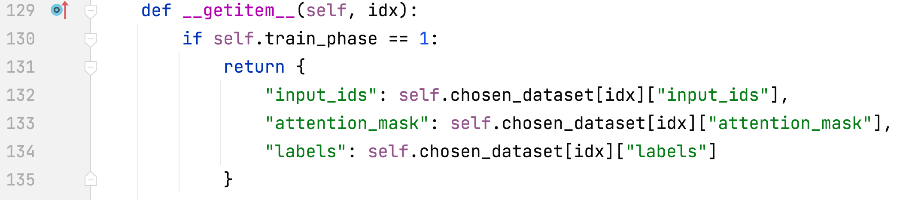

- alpaca_rlhf/deepspeed_chat/training/utils/data/raw_datasets.py#MultiTurnAlpacaDataset

- 新增 MultiTurnAlpacaDataset（多轮对话数据集）

- 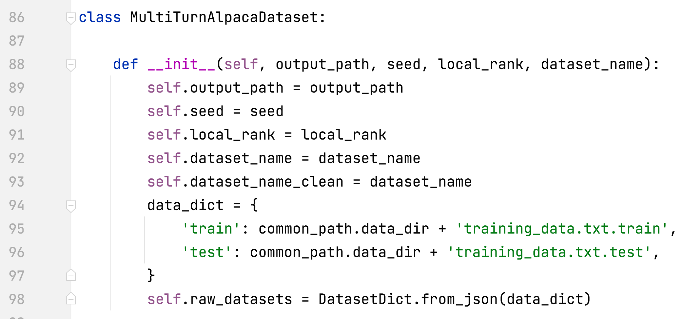

- alpaca_rlhf/deepspeed_chat/training/utils/module/lora.py#convert_linear_layer_to_lora

- 支持 LoRA 多模块名称

- 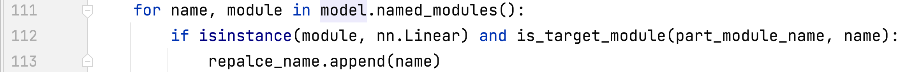

### 第 2 步

- 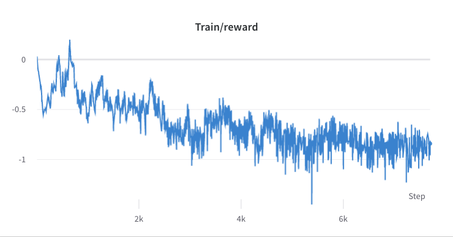

- 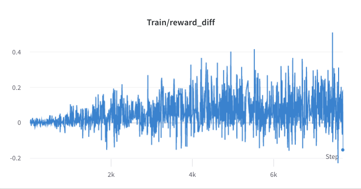

- 统计所选回复的奖励值的均值和标准差，并在第 3 步中用于对奖励进行归一化。在一次实验中，这两个值分别为 -0.8677118420600891 和 0.2210693359375，并在 alpaca_rlhf/deepspeed_chat/training/step3_rlhf_finetuning/ppo_trainer.py#DeepSpeedPPOTrainer#generate_experience 方法中使用：

- 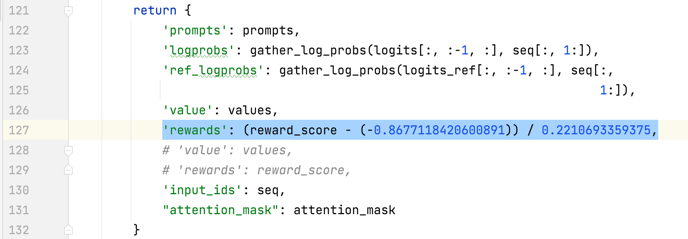

- step3: sh run.sh --num_gpus 2 /tmp/pycharm_project_227/alpaca_rlhf/deepspeed_chat/training/step3_rlhf_finetuning/main.py --data_output_path /root/autodl-tmp/rlhf/tmp/ --actor_model_name_or_path /root/autodl-tmp/rlhf/actor/ --tokenizer_name_or_path decapoda-research/llama-7b-hf --critic_model_name_or_path /root/autodl-tmp/rlhf/critic --actor_zero_stage 2 --critic_zero_stage 2 --num_padding_at_beginning 0 --per_device_train_batch_size 4 --per_device_mini_train_batch_size 4 --ppo_epochs 2 --actor_learning_rate 9.65e-6 --critic_learning_rate 5e-6 --gradient_accumulation_steps 1 --deepspeed --actor_lora_dim 8 --actor_lora_module_name q_proj --critic_lora_dim 8 --critic_lora_module_name q_proj,k_proj --only_optimize_lora --output_dir /root/autodl-tmp/rlhf/final

- 第 3 步的训练过程

- 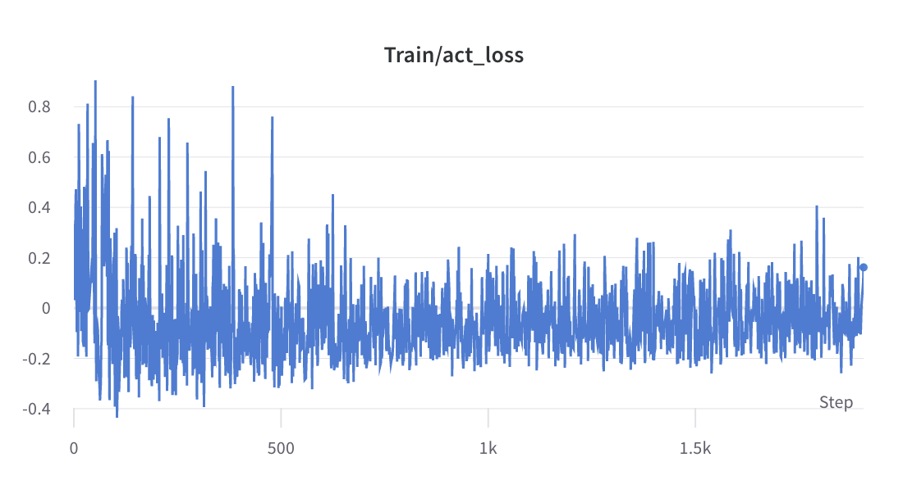

- 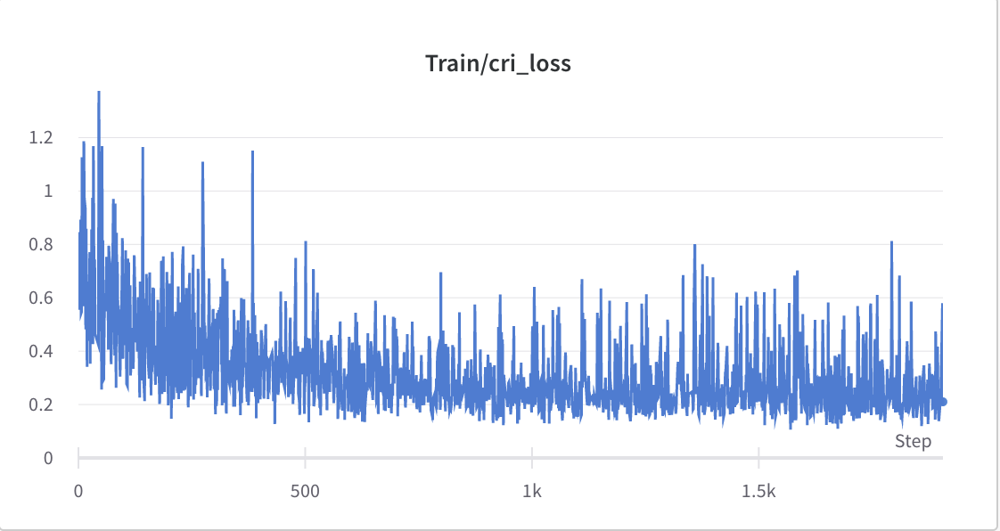

- 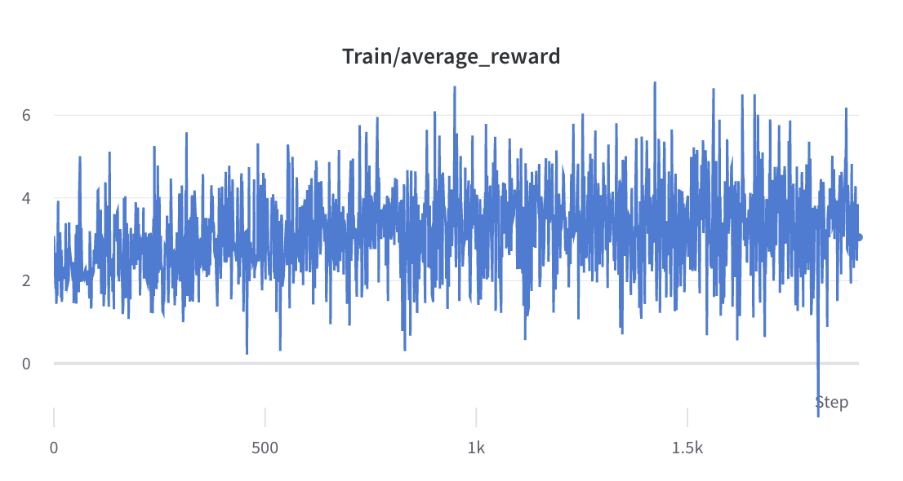

- 推理

- nohup sh run_inference.sh 0 alpaca_rlhf/inference/llama_chatbot_gradio.py --path /root/autodl-tmp/rlhf/final/actor > rlhf_inference.log 2>&1 &

- nohup sh run_inference.sh 0 alpaca_rlhf/inference/llama_chatbot_gradio.py --path /root/autodl-tmp/rlhf/actor > sft_inference.log 2>&1 &

## SFT 与 RLHF 的对比

- 对话

- SFT

- 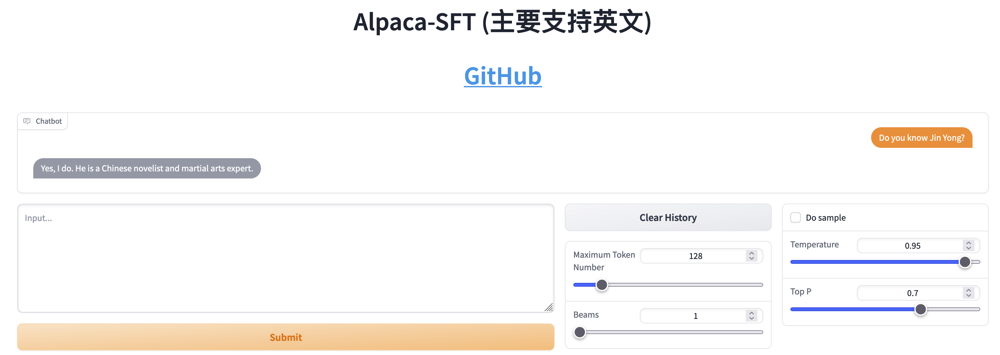

- RLHF

- 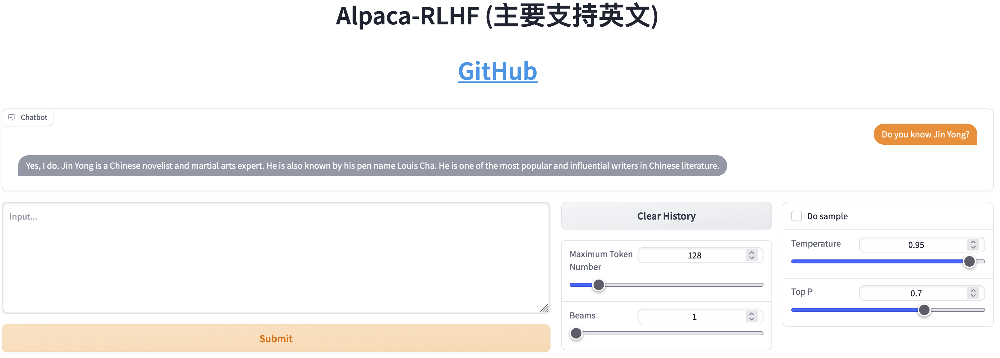

- 故事生成

- SFT

- 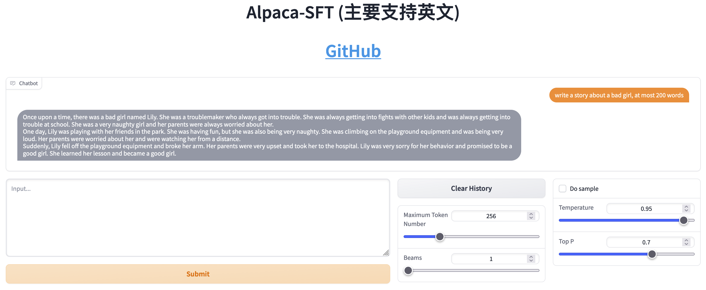

- RLHF

- 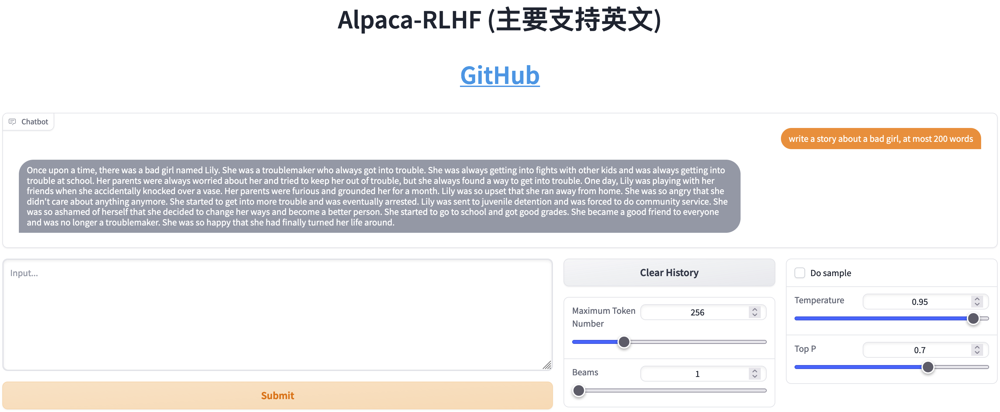

## 参考

### 文章

- [如何正确复现 Instruct GPT / RLHF?](https://zhuanlan.zhihu.com/p/622134699)

- [影响 PPO 算法性能的 10 个关键技巧（附 PPO 算法简洁 PyTorch 实现）](https://zhuanlan.zhihu.com/p/512327050)

### 来源

- [Awesome RLHF](https://github.com/opendilab/awesome-RLHF)

### 工具

- [DeepSpeed-Chat](https://github.com/microsoft/DeepSpeedExamples/tree/master/applications/DeepSpeed-Chat)

### 数据集

- [Stanford Human Preferences Dataset (SHP)](https://huggingface.co/datasets/stanfordnlp/SHP)

- [HH-RLHF](https://huggingface.co/datasets/Anthropic/hh-rlhf)

- [hh-rlhf](https://github.com/anthropics/hh-rlhf)

- 基于人类反馈强化学习训练有帮助且无害的助手 [[论文](https://arxiv.org/abs/2204.05862)]

- [Dahoas/static-hh](https://huggingface.co/datasets/Dahoas/static-hh)

- [Dahoas/rm-static](https://huggingface.co/datasets/Dahoas/rm-static)

- GPT-4-LLM

- [GitHub](https://github.com/Instruction-Tuning-with-GPT-4/GPT-4-LLM)

- [论文](https://arxiv.org/pdf/2304.03277.pdf)

- [网站](https://instruction-tuning-with-gpt-4.github.io/)

- Open-Assistant

- [网站](https://open-assistant.io/zh)

- [GitHub](https://github.com/LAION-AI/Open-Assistant)

- [论文](./papers/2023-OpenAssistant%20Conversations%20-%20Democratizing%20Large%20Language%20Model%20Alignment.pdf)

